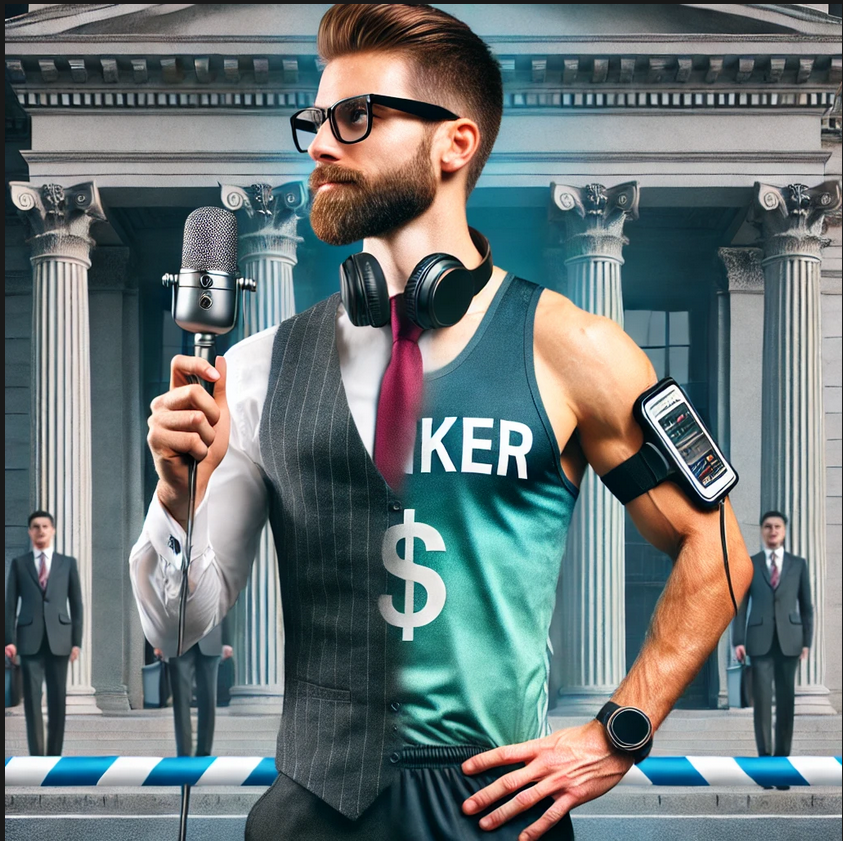

    Corrida Garantida

    <audio src="output/podcast_editado.MP3" controls title="Podcast editado"></audio>

# Projeto Podcast Gerado por I.A.s

 > ℹ️ **NOTE:** Este é o repositório desenvolvido durante uma live no Youtube em parceria com a [DIO](https://dio.me)

Projeto com o objetivo de gerar um podcast utilizando ferramentas de IA através de prompts mais trabalhado.

Projeto entregue: Podcast "Corrida Garantida" na pasta output e capa na pasta assets.

## 💻 Tecnologias utilizadas no projeto

- [ChatGPT](https://chat.openai.com/) 
- [ElevenLabs](https://beta.elevenlabs.io/)

## ✨ Como foi feito ?

- Roteiro e capa gerados via chatgpt
- Audio gerado pela elevenLabs

## Prompts ChatGPT

"você é um roteirista de podcast, e vamos criar um podcast de corrida focado em bem estar, e eu gostaria de uma ajuda sua para criar cinco sugestões de nomes criativos para um podcast Corridas feito por um bancário. Então, imagina que são bancários e que tenham um trocadilho com a profissão.
O nome deve ser enxuto. Um nome e um subtítulo. Outra coisa que eu quero é que o nome tenha algum trocadilho com a profissão de bancário
Não quero que o nome contenha palavras em inglês"

"Você é um roteirista de podcast e vamos criar um roteiro de um podcast de tecnologia, focado em corrida cujo nome é "Corrida Garantida - Investindo em saúde, rendendo bem-estar" e tem foco em dicas para iniciar na atividade física de corrida."

